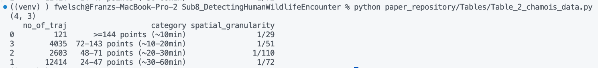
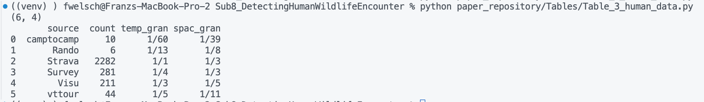
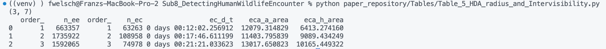
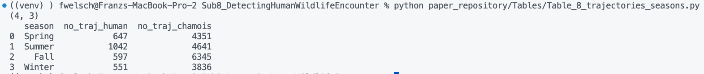

# Reproducibility Review of: "A New Spatio-Temporal Method for Detecting Human-Wildlife Encounters from GNSS Trajectories"


## Reproduction Metadata

**Submission Title:** A New Spatio-Temporal Method for Detecting Human-Wildlife Encounters from GNSS Trajectories

**Post Review Title:** A Method for Spatializing Disturbance by Detecting Human-Wildlife Encounters from GNSS Trajectories

**Authors:**

- John Dawson (LASTIG, Univ Gustave Eiffel, IGN-GéoData Paris, Paris, France) | (LIFAT, University of Tours, Blois, France)
- Veronika Peralta (LIFAT, University of Tours, Blois, France)
- Ana-Maria Olteanu-Raimond (LASTIG, Univ Gustave Eiffel, IGN-GéoData Paris, Paris, France)
- Thomas Devogele (LIFAT, University of Tours, Blois, France)
- Mathieu Garel (Office Français de la Bodiversité, Gières, France)

**Ref. Paper:** ---

**Reproducibility Reviewer:** Franz Welscher (Department of Geoinformatics, University of Salzburg, Austria) | (https://orcid.org/0000-0003-2432-1880)

**Date of Review Completion:** 24.03.2026

**Review Repository:** ---

**Ref. Certificate:** ---

# Summary

The reproduction was mostly successful by following the repository README and adapting the workflow to the available environment, using PostgreSQL 15 instead of 16. Several issues prevented a fully seamless rerun: one invalid geometry in france.csv blocked database import, the create_filltered_hda_table function failed because of a timestamp/date-style mismatch, the DEM file used in the analysis was not included and had to be requested from the authors, and the Figure 8 script contained an SQL error that required a manual fix. After applying these corrections and removing the dependence on the failed france import all figures and tables were reproduced. However, there were some discrepancies.

Some reported outputs could not be matched exactly: Table 2 was not reproduced, Table 3 showed slight differences in the spatial granularity of “Survey Project,” Table 5 had small value discrepancies, and the Fall value in Table 8 differed by one. The main challenges for future reproduction are incomplete provision of required data files, fragile database import and timestamp handling, and script-level errors in the published code that require manual debugging before results can be regenerated reliably.

# Reproducibility Reviewer Notes

Followed Readme.md file of manuscript repository.

- Used PostgreSQL 15 instead of 16 (because it was already installed)
- Link to data files in methodology section of anonymous manuscript
- The france.csv file contains an invalid geometry and cannot be imported into the database
- Due to an improper datestyle the "create_filltered_hda_table"-function fails to execute

  ```
  Traceback (most recent call last):
  File "/Users/fwelsch/Storage/Workspace/Publications/2026_AGILE_Reproducibility_Review/Sub8_DetectingHumanWildlifeEncounter/paper_repository/1_main_Create_Encounter_Events.py", line 50, in <module>
  my_utils.encounter_events(
  File "/Users/fwelsch/Storage/Workspace/Publications/2026_AGILE_Reproducibility_Review/Sub8_DetectingHumanWildlifeEncounter/paper_repository/my_utils.py", line 115, in encounter_events
  tracks, tracks_simp_new_filter, id_traj = create_filltered_hda_table(
  ^^^^^^^^^^^^^^^^^^^^^^^^^^^
  File "/Users/fwelsch/Storage/Workspace/Publications/2026_AGILE_Reproducibility_Review/Sub8_DetectingHumanWildlifeEncounter/paper_repository/my_utils.py", line 1095, in create_filltered_hda_table
  curs.executemany("""
  psycopg2.errors.DatetimeFieldOverflow: date/time field value out of range: "23/05/2017 06:10:00"
  LINE 20: '23/05/2017 06:10:00',
  ^
  HINT: Perhaps you need a different "datestyle" setting.
  ```

  **Fixed through adjusting the timestamps:**

  ```python
  from datetime import datetime

  def _to_time(v):
        if v is None:
            return None
        if hasattr(v, "time"):
            return v.time()
        return datetime.strptime(v, "%d/%m/%Y %H:%M:%S").time()

  d = list(zip(
    tracks_simp.getAnalyticalFeature('id_point')[0:-1],
    [_to_time(v) for v in tracks_simp.getTimestamps_str()[0:-1]],
    tracks_simp.getAnalyticalFeature('geom')[0:-1],
    tracks_simp.getAnalyticalFeature('id_sub_traj')[0:-1],
    id_traj[0:-1],
    tracks_simp.getAnalyticalFeature('date_2')[0:-1],

    tracks_simp.getAnalyticalFeature('id_point')[1:],
    [_to_time(v) for v in tracks_simp.getTimestamps_str()[1:]],
    tracks_simp.getAnalyticalFeature('geom')[1:],
    tracks_simp.getAnalyticalFeature('id_sub_traj')[1:],
    id_traj[1:],

    tracks_simp.getAnalyticalFeature('grid_x')[0:-1],
    tracks_simp.getAnalyticalFeature('grid_y')[0:-1],
    tracks_simp.getAnalyticalFeature('grid_x')[1:],
    tracks_simp.getAnalyticalFeature('grid_y')[1:]
    ))
  ```

- Requested the used dem.tif-file from the author, as it was not provided
- Due to the failed import of france in the db-table, I had to remove the following lines of code from the figure 8 generation script. Then the figure was reproducible.

```python
france = """
    select * from france
    """

france  = gpd.GeoDataFrame.from_postgis(france, con)

# Plot the GeoDataFrame
france.plot(ax=ax_inset, edgecolor='black', facecolor='lightblue')

france = france.to_crs(2154)
france.plot(ax=ax_inset, color='lightblue', edgecolor='black', alpha = 0.5)
```

- The script for figure 8 had an error in the SQL-Query (even in the latest script version) that was solved by adjusting the final lines of the query in the "querry_ppa_indiv"-function in the "my_utils_plotting"-script

```python
 """ + vis__ + """
            ) as q
    group by q.traj_human, q.indiv_animal"""
```

- Couldn't reproduce Table 2, output of the script was different



**Note:** Table 2 in the original submission showed the values before outlier filtering and the values shown here are after outlier filtering. The authors updated the table to the one with the outlier filtered values.

- Spatial Granularity of "Survey Project" in Table 3 slightly differed



- Values in Table 5 minimally differed from the ones reported in the manuscript



- Fall value in Table 8 differs by 1



# Citing this document

This report is part of the reproducibility review at the AGILE conference. For more information see https://reproducible-agile.github.io/. This document is published on OSF/ResearchEquals at <OSF/ResearchEquals DOI HERE>.
To cite the report use
[include full citation with the DOI, see summary table]
